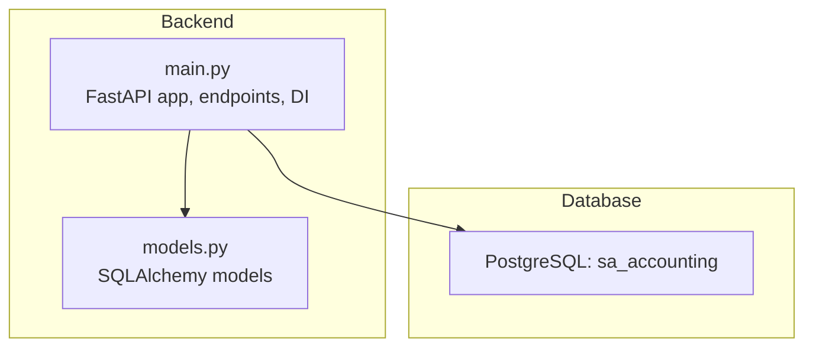
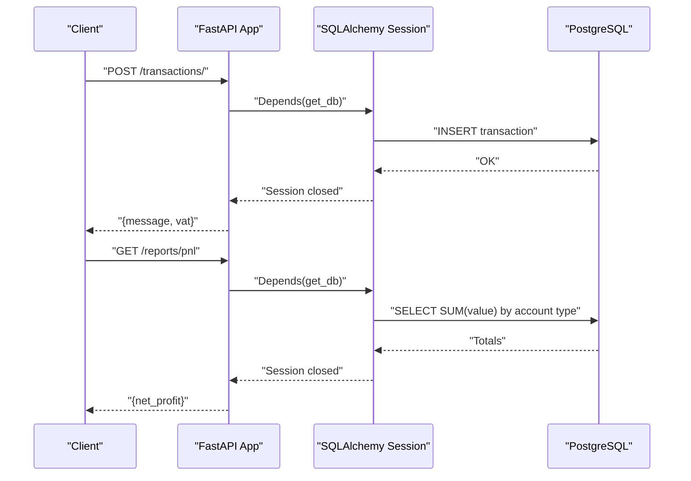
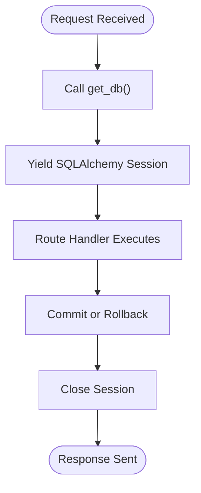
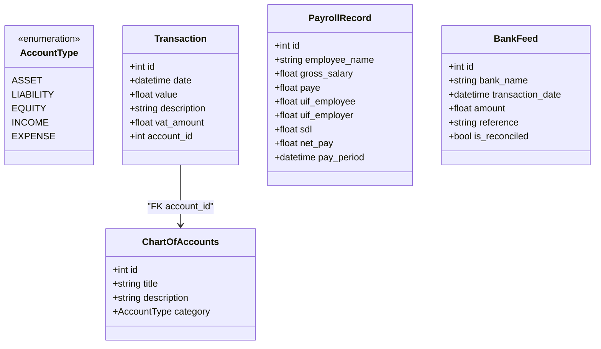
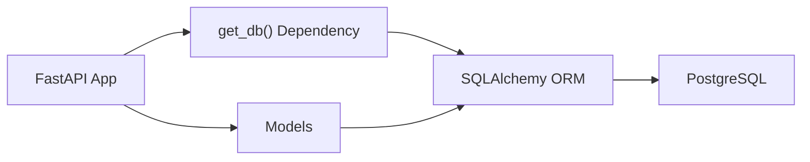

# Backend API Documentation

<cite>
**Referenced Files in This Document**
- [main.py](file://sa-accounting-app/backend/main.py)
- [models.py](file://sa-accounting-app/backend/models.py)
</cite>

## Table of Contents
1. [Introduction](#introduction)
2. [Project Structure](#project-structure)
3. [Core Components](#core-components)
4. [Architecture Overview](#architecture-overview)
5. [Detailed Component Analysis](#detailed-component-analysis)
6. [Dependency Analysis](#dependency-analysis)
7. [Performance Considerations](#performance-considerations)
8. [Troubleshooting Guide](#troubleshooting-guide)
9. [Conclusion](#conclusion)
10. [Appendices](#appendices)

## Introduction
This document describes the FastAPI backend endpoints for Accountflow’s accounting application. It focuses on two primary endpoints:
- POST /transactions/: Creates a transaction and calculates South African VAT at 15%.
- GET /reports/pnl: Generates a profit and loss summary by computing net profit from income and expense totals.

It also documents the database dependency injection pattern using SQLAlchemy sessions, authentication considerations, input validation, error handling strategies, rate limiting considerations, and future extension points.

## Project Structure
The backend consists of a minimal FastAPI application with a small set of models for accounting data.

**Diagram sources**
- [main.py:1-35](file://sa-accounting-app/backend/main.py#L1-L35)
- [models.py:1-50](file://sa-accounting-app/backend/models.py#L1-L50)

**Section sources**
- [main.py:1-35](file://sa-accounting-app/backend/main.py#L1-L35)
- [models.py:1-50](file://sa-accounting-app/backend/models.py#L1-L50)

## Core Components
- FastAPI Application: Declares two endpoints and integrates with SQLAlchemy for persistence.
- Database Layer: Uses SQLAlchemy ORM with a session factory and dependency injection via get_db().
- Models: Define chart of accounts categories and transaction records, including VAT handling.

Key implementation references:
- Endpoint registration and route handlers
- Dependency injection for database sessions
- Transaction model with VAT field
- Account type enumeration for categorization

**Section sources**
- [main.py:19-35](file://sa-accounting-app/backend/main.py#L19-L35)
- [models.py:8-30](file://sa-accounting-app/backend/models.py#L8-L30)

## Architecture Overview
The backend follows a straightforward layered architecture:
- HTTP layer: FastAPI routes
- Business logic: Minimal calculations and queries
- Persistence layer: SQLAlchemy ORM with PostgreSQL

**Diagram sources**
- [main.py:21-35](file://sa-accounting-app/backend/main.py#L21-L35)
- [models.py:22-29](file://sa-accounting-app/backend/models.py#L22-L29)

## Detailed Component Analysis

### Endpoint: POST /transactions/
Purpose:
- Record a transaction with a monetary value and description.
- Automatically calculate South African VAT at 15%.
- Persist the transaction and return a success message along with the calculated VAT.

HTTP Method and Path:
- POST /transactions/

Parameters:
- value: float
- desc: str

Authentication:
- No explicit authentication is configured in the endpoint signature. If authentication is required, integrate middleware or decorators at the application level.

Request Body:
- Form-encoded or JSON payload containing:
  - value: float
  - desc: str

Response:
- Success: JSON object with:
  - message: string
  - vat: float (calculated as value × 0.15)

Example curl command:
- curl -X POST "http://localhost:8000/transactions/" -H "Content-Type: application/json" -d '{"value": 100.0, "desc": "Service Fee"}'

Expected response:
- {"message": "Transaction recorded", "vat": 15.0}

Common errors:
- Validation failures if value is not a number or desc is missing.
- Database errors if commit fails or connection drops.
- HTTP 422 Unprocessable Entity for invalid parameters.
- HTTP 500 Internal Server Error for server-side failures.

Notes:
- VAT is computed client-side in the handler and stored in the transaction record.

**Section sources**
- [main.py:21-28](file://sa-accounting-app/backend/main.py#L21-L28)

### Endpoint: GET /reports/pnl
Purpose:
- Compute a simple profit and loss summary by subtracting total expenses from total income.

HTTP Method and Path:
- GET /reports/pnl

Parameters:
- None

Authentication:
- No explicit authentication is configured in the endpoint signature.

Request Body:
- None

Response:
- JSON object with:
  - net_profit: float (computed as sum(income) - sum(expenses))

Example curl command:
- curl -X GET "http://localhost:8000/reports/pnl"

Expected response:
- {"net_profit": 1200.0}

Common errors:
- Database query failures or misconfiguration.
- HTTP 500 Internal Server Error for server-side failures.

Notes:
- The endpoint currently sums all transactions filtered by account type. Ensure the underlying query aligns with the intended chart of accounts categories.

**Section sources**
- [main.py:30-35](file://sa-accounting-app/backend/main.py#L30-L35)

### Database Dependency Injection Pattern
The application uses a standard SQLAlchemy session lifecycle managed via a dependency function.

Key elements:
- get_db(): Creates a local session and yields it to the endpoint. Ensures the session is closed after the request completes.
- Session factory: Bound to a PostgreSQL engine.
- Route handlers accept db: Session = Depends(get_db) to access the database within request scope.

**Diagram sources**
- [main.py:12-17](file://sa-accounting-app/backend/main.py#L12-L17)

**Section sources**
- [main.py:8-17](file://sa-accounting-app/backend/main.py#L8-L17)
- [main.py:21-35](file://sa-accounting-app/backend/main.py#L21-L35)

### Data Models Overview
The models define the accounting domain and support the endpoints.

**Diagram sources**
- [models.py:8-50](file://sa-accounting-app/backend/models.py#L8-L50)

**Section sources**
- [models.py:8-30](file://sa-accounting-app/backend/models.py#L8-L30)

## Dependency Analysis
- FastAPI app depends on SQLAlchemy for ORM and database connectivity.
- Endpoints depend on get_db() for session management.
- Transaction model encapsulates VAT and links to chart of accounts.

**Diagram sources**
- [main.py:12-17](file://sa-accounting-app/backend/main.py#L12-L17)
- [models.py:22-29](file://sa-accounting-app/backend/models.py#L22-L29)

**Section sources**
- [main.py:12-17](file://sa-accounting-app/backend/main.py#L12-L17)
- [models.py:22-29](file://sa-accounting-app/backend/models.py#L22-L29)

## Performance Considerations
- Session lifecycle: Sessions are opened per request and closed immediately after, minimizing long-lived connections.
- Query complexity: PnL endpoint performs simple aggregations; ensure appropriate indexing on value and account_id fields for scalability.
- Network latency: Database round-trips occur per request; consider caching strategies for frequently accessed reports.
- Concurrency: FastAPI handles concurrent requests efficiently; ensure database connection pooling is configured appropriately.

[No sources needed since this section provides general guidance]

## Troubleshooting Guide
Common issues and resolutions:
- Authentication: If authentication is required, configure middleware or decorators at the application level. Currently, endpoints do not enforce authentication.
- Validation errors: Ensure value is a numeric type and desc is present. FastAPI will return HTTP 422 for invalid payloads.
- Database connectivity: Verify the PostgreSQL connection string and credentials. Confirm the database exists and is reachable.
- PnL computation: Ensure transactions are categorized under Income and Expense types as expected by the endpoint logic.
- Rate limiting: Not implemented. Consider adding rate limiting middleware to protect endpoints from abuse.

**Section sources**
- [main.py:21-35](file://sa-accounting-app/backend/main.py#L21-L35)

## Conclusion
The backend exposes two focused endpoints for transaction recording with VAT calculation and a simple profit and loss summary. It uses a clean dependency injection pattern for database sessions and a straightforward model set for accounting data. Future enhancements could include authentication, rate limiting, richer report endpoints, and improved input validation.

[No sources needed since this section summarizes without analyzing specific files]

## Appendices

### API Definitions

- POST /transactions/
  - Description: Create a transaction and compute VAT at 15%.
  - Authentication: Not enforced by endpoint.
  - Request body: value (float), desc (str).
  - Response: message (string), vat (float).
  - Example curl: See “Endpoint: POST /transactions/”.
  - Common errors: HTTP 422 for validation, HTTP 500 for server errors.

- GET /reports/pnl
  - Description: Compute net profit from income and expense totals.
  - Authentication: Not enforced by endpoint.
  - Request body: None.
  - Response: net_profit (float).
  - Example curl: See “Endpoint: GET /reports/pnl”.
  - Common errors: HTTP 500 for server errors.

### Security and Rate Limiting
- Authentication: Not configured in the provided endpoints. Integrate authentication middleware or decorators as needed.
- Authorization: Not configured. Consider role-based access controls for sensitive endpoints.
- Rate limiting: Not implemented. Add middleware to prevent abuse and protect resources.
- Input validation: FastAPI validates basic types; consider Pydantic models for stricter validation and sanitization.

### API Versioning and Backward Compatibility
- Current state: No explicit versioning is present.
- Recommendations:
  - Prefix URLs with a version segment (e.g., /api/v1/transactions/).
  - Maintain backward compatibility by deprecating old endpoints gracefully.
  - Use OpenAPI/Swagger for discoverability and evolve schemas carefully.

### Potential Extensions
- Additional endpoints:
  - GET /reports/income-statement
  - GET /reports/balance-sheet
  - GET /transactions/{id}
  - PUT /transactions/{id}
  - DELETE /transactions/{id}
- Enhancements:
  - Add Pydantic models for robust request/response schemas.
  - Implement pagination for large datasets.
  - Add audit logs and transaction timestamps.
  - Integrate with external payroll and bank feeds.

[No sources needed since this section provides general guidance]