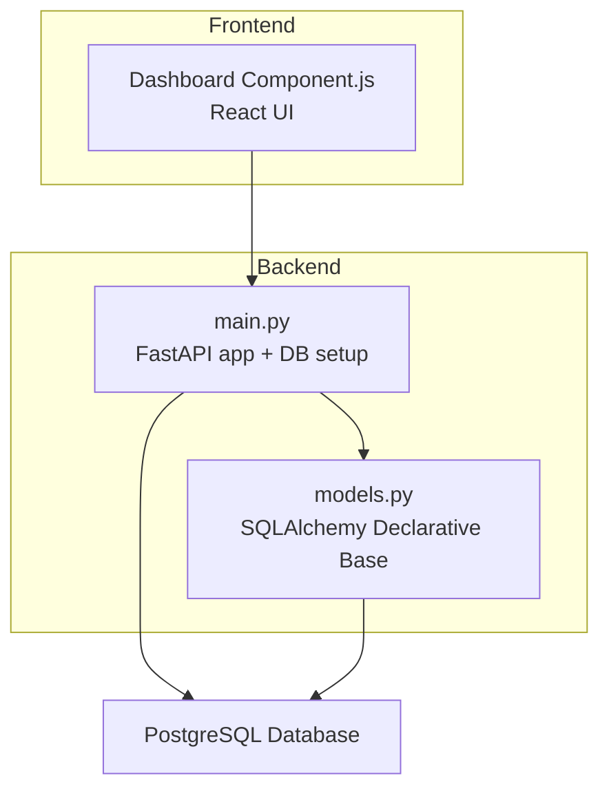
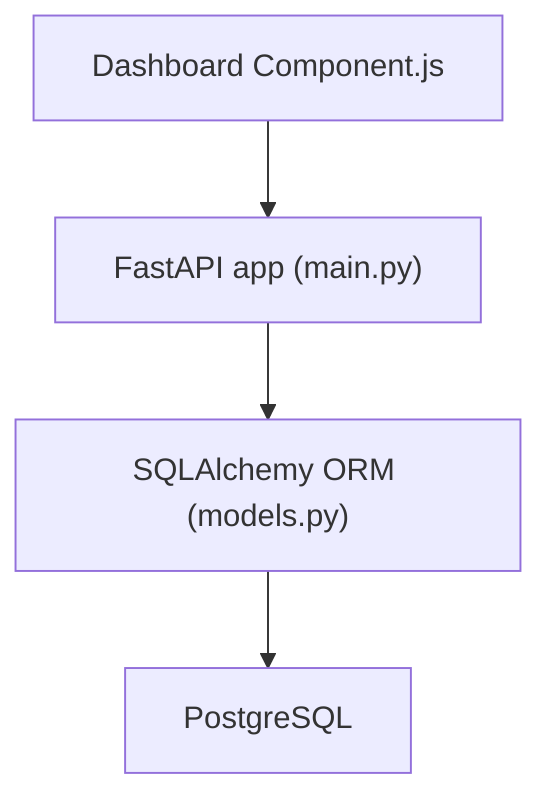
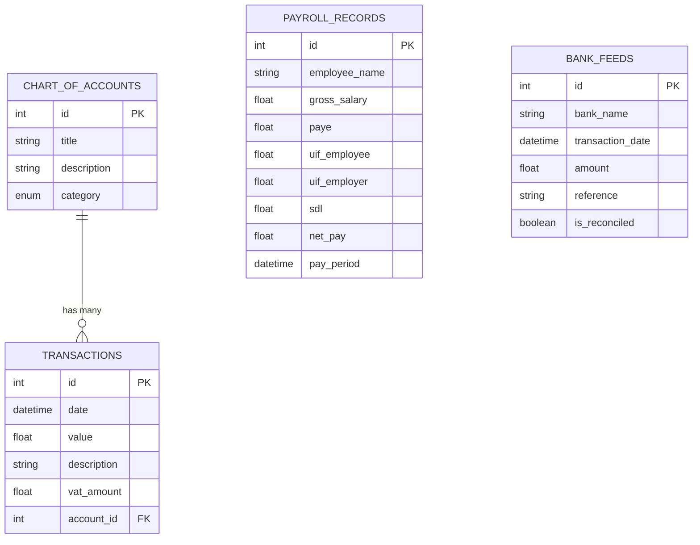
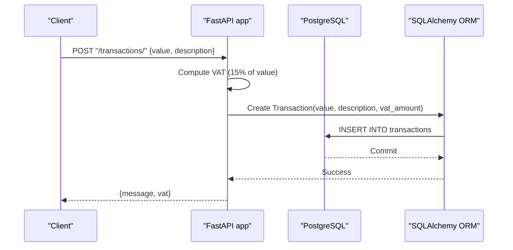
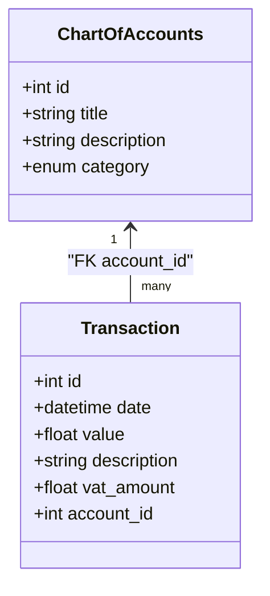
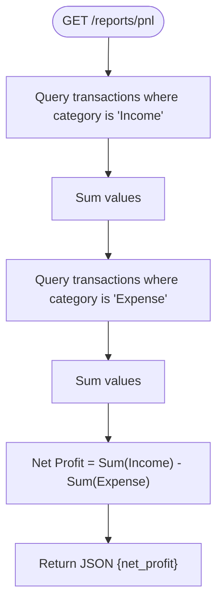
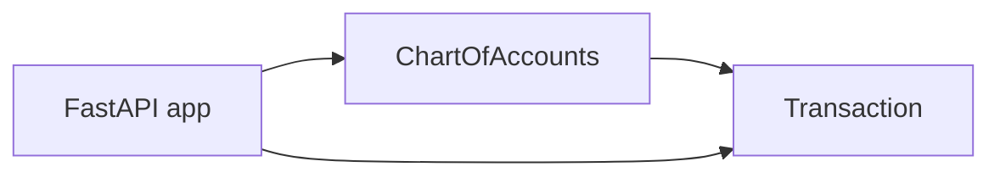

# Database Schema Design

<cite>
**Referenced Files in This Document**
- [models.py](file://sa-accounting-app/backend/models.py)
- [main.py](file://sa-accounting-app/backend/main.py)
- [Dashboard Component.js](file://sa-accounting-app/frontend/Dashboard Component.js)
</cite>

## Table of Contents
1. [Introduction](#introduction)
2. [Project Structure](#project-structure)
3. [Core Components](#core-components)
4. [Architecture Overview](#architecture-overview)
5. [Detailed Component Analysis](#detailed-component-analysis)
6. [Dependency Analysis](#dependency-analysis)
7. [Performance Considerations](#performance-considerations)
8. [Troubleshooting Guide](#troubleshooting-guide)
9. [Conclusion](#conclusion)
10. [Appendices](#appendices)

## Introduction
This document provides comprehensive database schema documentation for Accountflow’s SQLAlchemy models. It focuses on the Transaction, ChartOfAccounts, PayrollRecord, and BankFeed models, detailing entity relationships, field definitions, data types, primary and foreign keys, indexes and constraints, validation and business rules, and practical data access patterns. It also outlines performance considerations, data lifecycle and retention, security and privacy, and migration strategies for future schema evolution.

## Project Structure
The backend is a minimal FastAPI application backed by SQLAlchemy. The database engine is configured to PostgreSQL, and the application exposes endpoints for recording transactions and computing a simple profit-and-loss summary. The frontend dashboard component consumes the backend API and displays financial summaries.

**Diagram sources**
- [main.py:1-35](file://sa-accounting-app/backend/main.py#L1-L35)
- [models.py:1-50](file://sa-accounting-app/backend/models.py#L1-L50)

**Section sources**
- [main.py:1-35](file://sa-accounting-app/backend/main.py#L1-L35)
- [models.py:1-50](file://sa-accounting-app/backend/models.py#L1-L50)

## Core Components
This section documents the four core SQLAlchemy models and their relationships.

- ChartOfAccounts
  - Purpose: Defines chart-of-accounts entries with categories (Asset, Liability, Equity, Income, Expense).
  - Primary key: id (Integer).
  - Fields: title (String), description (String), category (Enum of AccountType).
  - Constraints: No explicit unique or check constraints defined in the model.

- Transaction
  - Purpose: Records financial transactions linked to a ChartOfAccounts entry.
  - Primary key: id (Integer).
  - Fields: date (DateTime), value (Float), description (String), vat_amount (Float, default 0.0), account_id (Integer, ForeignKey to chart_of_accounts.id).
  - Constraints: Foreign key constraint to ChartOfAccounts.id; default value for vat_amount.

- PayrollRecord
  - Purpose: Stores payroll details for employees.
  - Primary key: id (Integer).
  - Fields: employee_name (String), gross_salary (Float), paye (Float), uif_employee (Float), uif_employer (Float), sdl (Float), net_pay (Float), pay_period (DateTime, default UTC now).
  - Constraints: No explicit unique or check constraints defined in the model.

- BankFeed
  - Purpose: Captures bank transaction feeds for reconciliation.
  - Primary key: id (Integer).
  - Fields: bank_name (String), transaction_date (DateTime), amount (Float), reference (String), is_reconciled (Boolean, default False).
  - Constraints: No explicit unique or check constraints defined in the model.

Relationships
- Transaction.account_id references ChartOfAccounts.id (one-to-many: one ChartOfAccounts entry can have many Transactions).

Indexes and Constraints
- Primary keys are implicitly indexed by the database.
- No explicit indexes, unique constraints, or check constraints are defined in the models.

Validation and Business Rules
- VAT calculation: The backend computes VAT at 15% of the transaction value during creation.
- Profit and Loss computation: The endpoint sums transactions filtered by AccountType categories “Income” and “Expense”.

**Section sources**
- [models.py:15-50](file://sa-accounting-app/backend/models.py#L15-L50)
- [main.py:21-35](file://sa-accounting-app/backend/main.py#L21-L35)

## Architecture Overview
The application follows a straightforward layered architecture:
- Frontend (React) renders financial summaries.
- Backend (FastAPI) exposes endpoints and manages database sessions.
- SQLAlchemy ORM maps Python classes to database tables.
- PostgreSQL persists the data.

**Diagram sources**
- [main.py:1-35](file://sa-accounting-app/backend/main.py#L1-L35)
- [models.py:1-50](file://sa-accounting-app/backend/models.py#L1-L50)

## Detailed Component Analysis

### Entity Relationship Model
The ER model captures the core entities and their relationships.

**Diagram sources**
- [models.py:15-50](file://sa-accounting-app/backend/models.py#L15-L50)

**Section sources**
- [models.py:15-50](file://sa-accounting-app/backend/models.py#L15-L50)

### Transaction Model Analysis
- Data fields and types:
  - id (Integer, primary key)
  - date (DateTime)
  - value (Float)
  - description (String)
  - vat_amount (Float, default 0.0)
  - account_id (Integer, foreign key to chart_of_accounts.id)
- Business rules:
  - VAT is computed at 15% of value during creation.
- Data access patterns:
  - Creation endpoint accepts value and description, computes VAT, and persists a Transaction record.
- Validation:
  - No explicit column-level validators in the model; defaults apply.

**Diagram sources**
- [main.py:21-28](file://sa-accounting-app/backend/main.py#L21-L28)
- [models.py:22-29](file://sa-accounting-app/backend/models.py#L22-L29)

**Section sources**
- [models.py:22-29](file://sa-accounting-app/backend/models.py#L22-L29)
- [main.py:21-28](file://sa-accounting-app/backend/main.py#L21-L28)

### ChartOfAccounts Model Analysis
- Data fields and types:
  - id (Integer, primary key)
  - title (String)
  - description (String)
  - category (Enum AccountType)
- Relationships:
  - One ChartOfAccounts entry can have many Transactions.
- Validation:
  - No explicit column-level validators in the model.

**Diagram sources**
- [models.py:15-29](file://sa-accounting-app/backend/models.py#L15-L29)

**Section sources**
- [models.py:15-21](file://sa-accounting-app/backend/models.py#L15-L21)

### PayrollRecord Model Analysis
- Data fields and types:
  - id (Integer, primary key)
  - employee_name (String)
  - gross_salary (Float)
  - paye (Float)
  - uif_employee (Float)
  - uif_employer (Float)
  - sdl (Float)
  - net_pay (Float)
  - pay_period (DateTime, default UTC now)
- Validation:
  - No explicit column-level validators in the model.

**Section sources**
- [models.py:31-42](file://sa-accounting-app/backend/models.py#L31-L42)

### BankFeed Model Analysis
- Data fields and types:
  - id (Integer, primary key)
  - bank_name (String)
  - transaction_date (DateTime)
  - amount (Float)
  - reference (String)
  - is_reconciled (Boolean, default False)
- Validation:
  - No explicit column-level validators in the model.

**Section sources**
- [models.py:43-50](file://sa-accounting-app/backend/models.py#L43-L50)

### Profit and Loss Endpoint Flow
- The endpoint computes net profit by summing values for Income and Expense accounts.
- Current implementation uses a simplified filter; it does not join with ChartOfAccounts.

**Diagram sources**
- [main.py:30-35](file://sa-accounting-app/backend/main.py#L30-L35)
- [models.py:15-29](file://sa-accounting-app/backend/models.py#L15-L29)

**Section sources**
- [main.py:30-35](file://sa-accounting-app/backend/main.py#L30-L35)

## Dependency Analysis
- ChartOfAccounts and Transaction are coupled via a foreign key relationship.
- The Profit and Loss endpoint references AccountType and Transaction but does not join with ChartOfAccounts, which may lead to incorrect aggregation if categories are not consistently applied.

**Diagram sources**
- [models.py:15-29](file://sa-accounting-app/backend/models.py#L15-L29)
- [main.py:30-35](file://sa-accounting-app/backend/main.py#L30-L35)

**Section sources**
- [models.py:15-29](file://sa-accounting-app/backend/models.py#L15-L29)
- [main.py:30-35](file://sa-accounting-app/backend/main.py#L30-L35)

## Performance Considerations
- Data types:
  - Float is used for monetary amounts. Consider DECIMAL for precise accounting calculations to avoid floating-point rounding errors.
- Indexes:
  - Add indexes on frequently filtered columns such as Transaction.date, Transaction.account_id, PayrollRecord.pay_period, BankFeed.transaction_date, and BankFeed.is_reconciled.
- Queries:
  - The P&L endpoint performs two separate sums. Consider aggregating in a single query with grouping by category to reduce round-trips.
- Caching:
  - For read-heavy dashboards, cache aggregated summaries (e.g., monthly totals) with invalidation on write operations.
- Concurrency:
  - Use database transactions and connection pooling appropriately; the current setup uses autocommit disabled and manual commit.

[No sources needed since this section provides general guidance]

## Troubleshooting Guide
- VAT calculation mismatch:
  - Verify that the frontend sends numeric values and that the backend computes 15% correctly.
- Incorrect P&L results:
  - Ensure that Transaction records are associated with the correct ChartOfAccounts category. The current endpoint filters by AccountType directly on Transaction, which may not reflect the intended chart-of-accounts categories.
- Foreign key violations:
  - Confirm that account_id references an existing ChartOfAccounts id before inserting a Transaction.
- Data integrity:
  - For monetary fields, consider adding constraints or validators to enforce non-negative values where applicable.

**Section sources**
- [main.py:21-28](file://sa-accounting-app/backend/main.py#L21-L28)
- [main.py:30-35](file://sa-accounting-app/backend/main.py#L30-L35)
- [models.py:22-29](file://sa-accounting-app/backend/models.py#L22-L29)

## Conclusion
The current schema supports basic transaction recording and payroll storage with a simple profit-and-loss report. To improve correctness and performance, consider:
- Using DECIMAL for monetary fields.
- Adding indexes on frequently queried columns.
- Joining P&L queries with ChartOfAccounts to ensure category-based aggregation.
- Implementing explicit constraints and validations for financial data.
- Adopting a migration framework for controlled schema evolution.

[No sources needed since this section summarizes without analyzing specific files]

## Appendices

### Data Access Patterns Through SQLAlchemy ORM
- Creating a Transaction:
  - Compute VAT (15% of value).
  - Instantiate Transaction with value, description, and vat_amount.
  - Add to session and commit.
- Reading aggregated P&L:
  - Sum Transaction.value grouped by category via ChartOfAccounts association.

**Section sources**
- [main.py:21-28](file://sa-accounting-app/backend/main.py#L21-L28)
- [main.py:30-35](file://sa-accounting-app/backend/main.py#L30-L35)
- [models.py:22-29](file://sa-accounting-app/backend/models.py#L22-L29)

### Data Lifecycle, Retention, and Archival
- Retention:
  - Define retention periods for financial records (e.g., seven years for tax compliance).
- Archival:
  - Archive older records to cold storage or separate schema/tablespace.
- Purging:
  - Implement scheduled jobs to delete expired records after legal holds are satisfied.

[No sources needed since this section provides general guidance]

### Security, Privacy, and Access Control
- Transport:
  - Use TLS for database connections.
- Secrets:
  - Store credentials in environment variables or a secrets manager.
- Access control:
  - Enforce role-based access control at the API level.
- Data protection:
  - Encrypt sensitive fields at rest if required by regulations.

[No sources needed since this section provides general guidance]

### Migration Paths and Version Management
- Use a migration tool (e.g., Alembic) to manage schema changes.
- Version control database schema alongside application code.
- Back up before migrations; test in staging environments.

[No sources needed since this section provides general guidance]