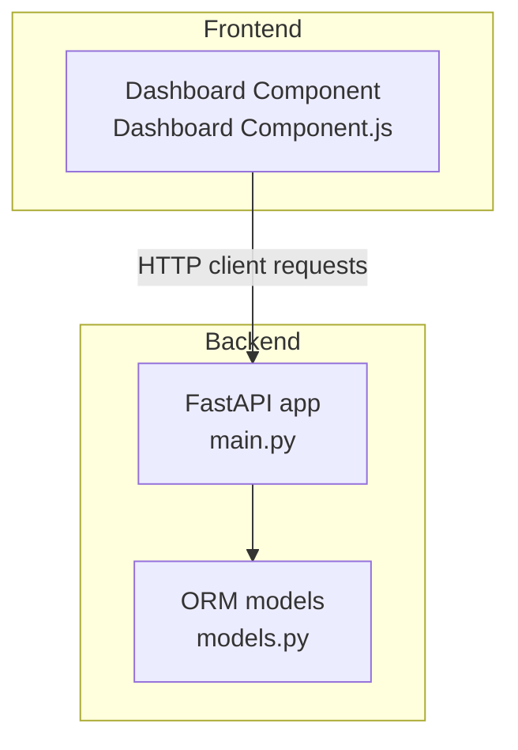
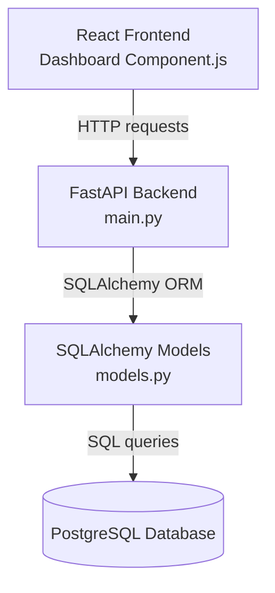
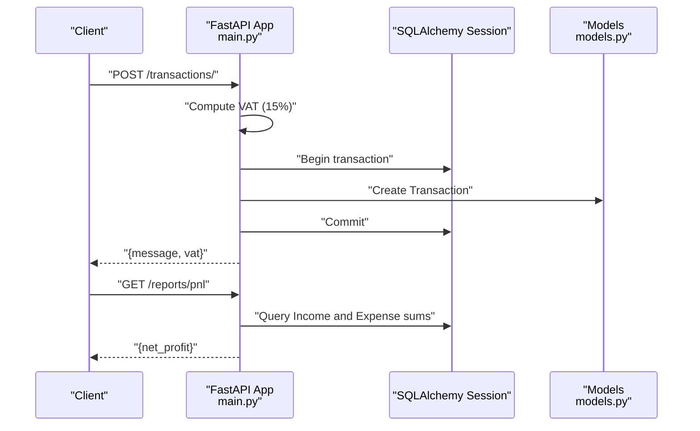
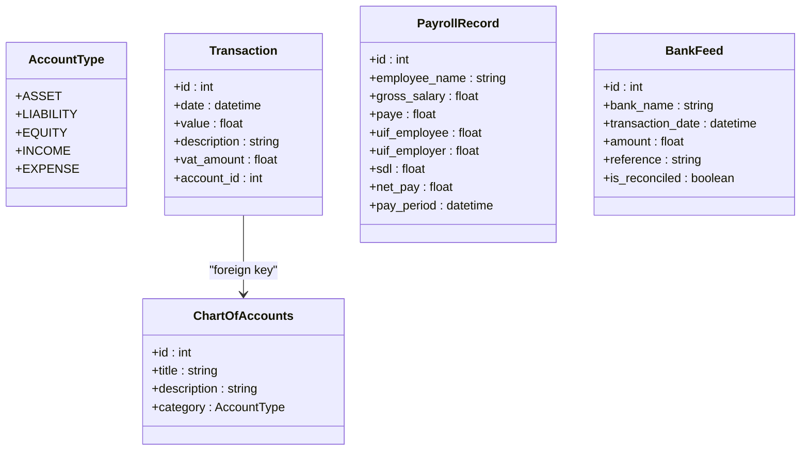
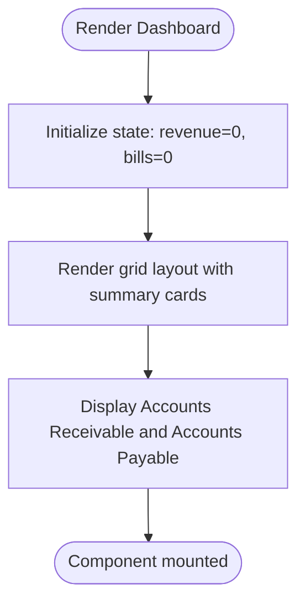
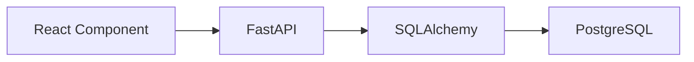

# Development Guidelines

<cite>
**Referenced Files in This Document**
- [backend/main.py](file://sa-accounting-app/backend/main.py)
- [backend/models.py](file://sa-accounting-app/backend/models.py)
- [frontend/Dashboard Component.js](file://sa-accounting-app/frontend/Dashboard Component.js)
- [docker-compose.yml](file://sa-accounting-app/docker-compose.yml)
</cite>

## Table of Contents
1. [Introduction](#introduction)
2. [Project Structure](#project-structure)
3. [Core Components](#core-components)
4. [Architecture Overview](#architecture-overview)
5. [Detailed Component Analysis](#detailed-component-analysis)
6. [Dependency Analysis](#dependency-analysis)
7. [Performance Considerations](#performance-considerations)
8. [Testing Strategies](#testing-strategies)
9. [Deployment Considerations](#deployment-considerations)
10. [Security Best Practices](#security-best-practices)
11. [Extensibility Guidelines](#extensibility-guidelines)
12. [Error Handling and Monitoring](#error-handling-and-monitoring)
13. [Contribution Guidelines](#contribution-guidelines)
14. [Conclusion](#conclusion)

## Introduction
This document provides comprehensive development guidelines for the Accountflow application. It covers backend development with Python and FastAPI, frontend development with JavaScript and React, testing strategies, deployment considerations, security practices, extensibility for features such as chart of accounts management, payroll processing, and bank integration, performance optimization, error handling, monitoring, and contribution processes. The guidance is grounded in the current repository structure and code.

## Project Structure
The repository follows a clear separation between backend and frontend:
- Backend: FastAPI application exposing accounting endpoints and SQLAlchemy ORM models.
- Frontend: A single React dashboard component demonstrating basic layout and state usage.

**Diagram sources**
- [backend/main.py:1-35](file://sa-accounting-app/backend/main.py#L1-L35)
- [backend/models.py:1-50](file://sa-accounting-app/backend/models.py#L1-L50)
- [frontend/Dashboard Component.js:1-26](file://sa-accounting-app/frontend/Dashboard Component.js#L1-L26)

**Section sources**
- [backend/main.py:1-35](file://sa-accounting-app/backend/main.py#L1-L35)
- [backend/models.py:1-50](file://sa-accounting-app/backend/models.py#L1-L50)
- [frontend/Dashboard Component.js:1-26](file://sa-accounting-app/frontend/Dashboard Component.js#L1-L26)

## Core Components
- FastAPI Application: Defines two endpoints: a transaction creation endpoint and a profit-and-loss summary endpoint. It also defines a database dependency for session management.
- ORM Models: Define core accounting entities including chart of accounts, transactions, payroll records, and bank feeds. They include enums for account categories and foreign key relationships.

Key implementation references:
- Backend app and endpoints: [backend/main.py:19-35](file://sa-accounting-app/backend/main.py#L19-L35)
- Database dependency: [backend/main.py:12-17](file://sa-accounting-app/backend/main.py#L12-L17)
- Models definition: [backend/models.py:8-50](file://sa-accounting-app/backend/models.py#L8-L50)

**Section sources**
- [backend/main.py:12-35](file://sa-accounting-app/backend/main.py#L12-L35)
- [backend/models.py:8-50](file://sa-accounting-app/backend/models.py#L8-L50)

## Architecture Overview
The system architecture is a thin backend API layer (FastAPI) backed by PostgreSQL via SQLAlchemy, consumed by a React frontend.

**Diagram sources**
- [backend/main.py:19-35](file://sa-accounting-app/backend/main.py#L19-L35)
- [backend/models.py:1-50](file://sa-accounting-app/backend/models.py#L1-L50)
- [frontend/Dashboard Component.js:1-26](file://sa-accounting-app/frontend/Dashboard Component.js#L1-L26)

## Detailed Component Analysis

### Backend API Endpoints
- Transaction Creation Endpoint: Accepts transaction value and description, computes South African VAT at 15%, persists the record, and returns a message and calculated VAT.
- Profit and Loss Summary Endpoint: Computes net profit by summing income and expense transactions.

**Diagram sources**
- [backend/main.py:21-35](file://sa-accounting-app/backend/main.py#L21-L35)
- [backend/models.py:22-29](file://sa-accounting-app/backend/models.py#L22-L29)

**Section sources**
- [backend/main.py:21-35](file://sa-accounting-app/backend/main.py#L21-L35)

### Database Models
The models define:
- AccountType enum for categorizing chart of accounts entries.
- ChartOfAccounts entity with title, description, and category.
- Transaction entity with date, value, description, VAT amount, and foreign key to chart of accounts.
- PayrollRecord entity with employee details, deductions, and pay period.
- BankFeed entity for reconciling bank transactions.

**Diagram sources**
- [backend/models.py:8-50](file://sa-accounting-app/backend/models.py#L8-L50)

**Section sources**
- [backend/models.py:8-50](file://sa-accounting-app/backend/models.py#L8-L50)

### Frontend Dashboard Component
The component renders a simple financial dashboard layout with two summary cards for receivables and payables. It initializes state for revenue and bills and applies Tailwind-based styling.

**Diagram sources**
- [frontend/Dashboard Component.js:3-23](file://sa-accounting-app/frontend/Dashboard Component.js#L3-L23)

**Section sources**
- [frontend/Dashboard Component.js:1-26](file://sa-accounting-app/frontend/Dashboard Component.js#L1-L26)

## Dependency Analysis
- Backend depends on FastAPI for routing and SQLAlchemy for ORM.
- Database connection is configured via a local PostgreSQL URL.
- Frontend is a standalone React component with minimal external dependencies.

**Diagram sources**
- [backend/main.py:1-10](file://sa-accounting-app/backend/main.py#L1-L10)
- [backend/models.py:1-6](file://sa-accounting-app/backend/models.py#L1-L6)
- [frontend/Dashboard Component.js:1](file://sa-accounting-app/frontend/Dashboard Component.js#L1)

**Section sources**
- [backend/main.py:1-10](file://sa-accounting-app/backend/main.py#L1-L10)
- [backend/models.py:1-6](file://sa-accounting-app/backend/models.py#L1-L6)
- [frontend/Dashboard Component.js:1](file://sa-accounting-app/frontend/Dashboard Component.js#L1)

## Performance Considerations
- Database Queries
  - Use pagination for large datasets and avoid N+1 queries by leveraging joined eager loading or explicit joins.
  - Index frequently filtered columns (e.g., account_id, pay_period, transaction_date).
  - Batch inserts for bulk transaction uploads.
- Backend
  - Enable database connection pooling and reuse sessions efficiently.
  - Use async workers for heavy computations (e.g., payroll calculations) and offload to queues.
  - Cache aggregated reports (e.g., P&L) with invalidation on data changes.
- Frontend
  - Virtualize long lists and lazy-load images.
  - Debounce user input for filters and search.
  - Split bundles and use code splitting for route-level components.

[No sources needed since this section provides general guidance]

## Testing Strategies
- API Endpoints
  - Unit tests using FastAPI TestClient to assert response codes, JSON schemas, and VAT computation correctness.
  - Integration tests to verify database writes and report aggregations.
- Database Operations
  - Use isolated test databases or migrations for test isolation.
  - Mock external integrations (payroll tax calculators, bank feeds) behind interfaces.
- React Components
  - Snapshot and DOM tests with React Testing Library to validate rendering and state updates.
  - Mock HTTP fetch to test dashboard summaries under various data scenarios.

[No sources needed since this section provides general guidance]

## Deployment Considerations
- Environment Configuration
  - Centralize configuration via environment variables for database URLs, secrets, and feature flags.
  - Use separate environments (dev, staging, prod) with distinct database instances.
- Database Setup
  - Provision PostgreSQL with appropriate extensions and collations for financial data.
  - Apply migrations on deploy using Alembic or equivalent.
- Backend
  - Containerize the FastAPI app with a minimal base image and multi-stage builds.
  - Configure health checks and readiness probes.
- Frontend
  - Build static assets and serve via CDN or containerized Nginx.
  - Set cache headers and enable gzip/brotli compression.
- Orchestration
  - Use Docker Compose for local/dev deployments; Kubernetes for production scaling.

[No sources needed since this section provides general guidance]

## Security Best Practices
- Financial Data Handling
  - Encrypt at rest and in transit; enforce TLS for all communications.
  - Sanitize and validate all inputs; apply strict schemas for API payloads.
- API Protection
  - Implement rate limiting, input length limits, and request size caps.
  - Add authentication and authorization; use short-lived tokens with refresh rotation.
- Input Validation
  - Use Pydantic models for request validation and serialization.
  - Escape HTML and sanitize user-generated content in reports.
- Secrets Management
  - Store secrets in environment variables or secret managers; never commit to source.

[No sources needed since this section provides general guidance]

## Extensibility Guidelines
- Chart of Accounts Management
  - Add CRUD endpoints for chart of accounts with hierarchical support and permissions.
  - Enforce referential integrity when deleting accounts with existing transactions.
- Payroll Processing
  - Introduce dedicated endpoints for payroll runs, tax calculation, and reporting.
  - Integrate with tax APIs for PAYE, UIF, and SDL calculations.
- Bank Integration
  - Implement secure bank feed ingestion with OAuth and webhook reconciliation.
  - Add batch reconciliation UI and audit logs.

[No sources needed since this section provides general guidance]

## Error Handling and Monitoring
- Error Handling Patterns
  - Raise domain-specific exceptions and convert to standardized API errors with context.
  - Log structured errors with correlation IDs for tracing.
- Logging Strategies
  - Use structured logging (JSON) with log levels and sampling for noisy endpoints.
  - Ship logs to centralized systems (e.g., ELK, Loki) with retention policies.
- Monitoring Approaches
  - Track latency, error rates, and throughput for API endpoints.
  - Alert on database timeouts, memory spikes, and failed reconciliation jobs.

[No sources needed since this section provides general guidance]

## Contribution Guidelines
- Code Style
  - Backend: PEP 8, type hints, docstrings, and consistent module organization.
  - Frontend: Airbnb or StandardJS style with TypeScript recommended for type safety.
- Code Review
  - Require at least one reviewer; focus on correctness, security, performance, and maintainability.
  - Use pull request templates to capture testing and changelog details.
- Branching
  - Feature branches merged via squash or rebase; keep commit messages clear and scoped.

[No sources needed since this section provides general guidance]

## Conclusion
These guidelines establish a foundation for building, securing, and operating the Accountflow application. By adhering to the outlined conventions, testing strategies, deployment practices, and extensibility patterns, contributors can deliver reliable financial software tailored to South African accounting needs.