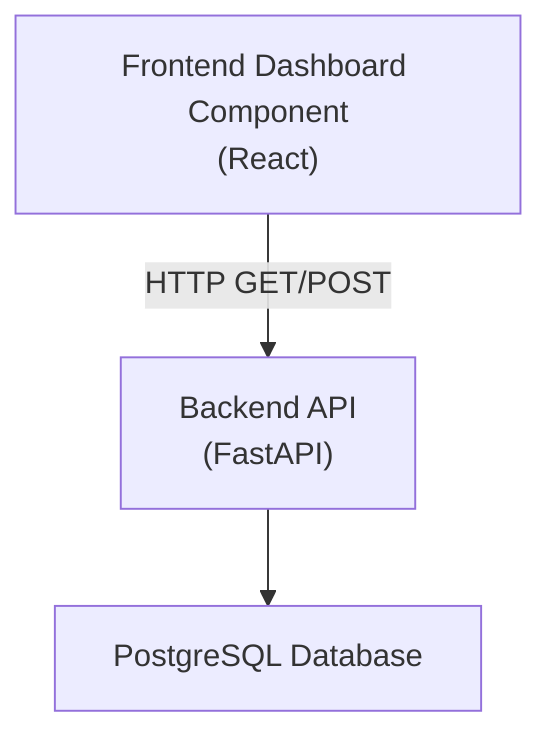
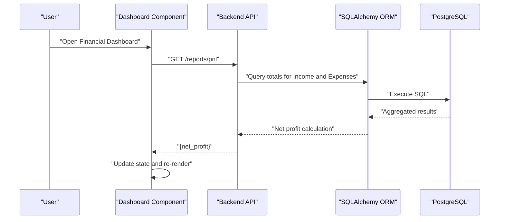
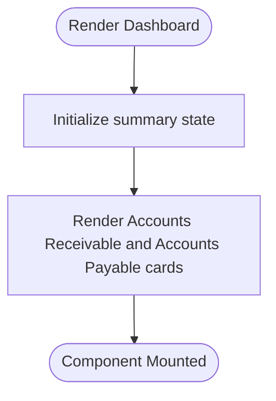
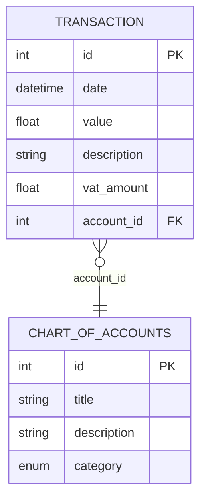
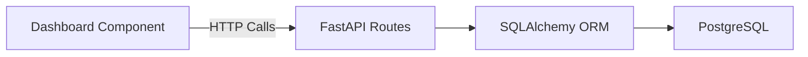

# Frontend Component Guide

<cite>
**Referenced Files in This Document**
- [Dashboard Component.js](file://sa-accounting-app/frontend/Dashboard Component.js)
- [main.py](file://sa-accounting-app/backend/main.py)
- [models.py](file://sa-accounting-app/backend/models.py)
</cite>

## Table of Contents
1. [Introduction](#introduction)
2. [Project Structure](#project-structure)
3. [Core Components](#core-components)
4. [Architecture Overview](#architecture-overview)
5. [Detailed Component Analysis](#detailed-component-analysis)
6. [Dependency Analysis](#dependency-analysis)
7. [Performance Considerations](#performance-considerations)
8. [Troubleshooting Guide](#troubleshooting-guide)
9. [Conclusion](#conclusion)

## Introduction
This guide documents the React dashboard component for Accountflow’s financial dashboard. It explains the component’s visual appearance, behavior, and user interaction patterns for financial data visualization. It covers props, state management, backend integration, responsive design, accessibility, error handling, and performance optimization. The component currently displays Accounts Receivable and Accounts Payable summaries and serves as a foundation for extending with charts, detailed transaction lists, and richer financial summaries.

## Project Structure
The project consists of a minimal frontend React component and a backend API built with FastAPI and SQLAlchemy. The frontend dashboard component renders static summary cards, while the backend exposes endpoints for transaction recording and profit/loss reporting.

**Diagram sources**
- [Dashboard Component.js:1-26](file://sa-accounting-app/frontend/Dashboard Component.js#L1-L26)
- [main.py:19-35](file://sa-accounting-app/backend/main.py#L19-L35)

**Section sources**
- [Dashboard Component.js:1-26](file://sa-accounting-app/frontend/Dashboard Component.js#L1-L26)
- [main.py:19-35](file://sa-accounting-app/backend/main.py#L19-L35)

## Core Components
- Dashboard component: Renders a two-card summary for Accounts Receivable and Accounts Payable. It uses React hooks for state initialization and applies Tailwind CSS classes for layout and styling.
- Backend API: Provides endpoints for transaction creation and profit/loss reporting. The API uses SQLAlchemy ORM to interact with a PostgreSQL database.

Key implementation highlights:
- State initialization for summary data with default zero values.
- Grid-based responsive layout using Tailwind CSS.
- Semantic card styling with color-coded borders for clarity.

**Section sources**
- [Dashboard Component.js:3-23](file://sa-accounting-app/frontend/Dashboard Component.js#L3-L23)
- [main.py:21-35](file://sa-accounting-app/backend/main.py#L21-L35)

## Architecture Overview
The dashboard component communicates with the backend API to fetch financial summaries. The backend processes requests, queries the database, and returns structured JSON responses. The current component does not yet integrate with the backend but can be extended to call the profit/loss endpoint and render charts.

**Diagram sources**
- [Dashboard Component.js:3-23](file://sa-accounting-app/frontend/Dashboard Component.js#L3-L23)
- [main.py:30-35](file://sa-accounting-app/backend/main.py#L30-L35)
- [models.py:22-29](file://sa-accounting-app/backend/models.py#L22-L29)

## Detailed Component Analysis

### Dashboard Component
- Purpose: Display financial summaries for Accounts Receivable and Accounts Payable.
- Props: None (no incoming props).
- State: summary with revenue and bills fields initialized to zero.
- Rendering: Two summary cards with labels and currency-formatted amounts.
- Styling: Uses Tailwind utility classes for padding, shadows, borders, and responsive grid layout.

**Diagram sources**
- [Dashboard Component.js:3-23](file://sa-accounting-app/frontend/Dashboard Component.js#L3-L23)

**Section sources**
- [Dashboard Component.js:3-23](file://sa-accounting-app/frontend/Dashboard Component.js#L3-L23)

### Backend API Integration
- Endpoint: GET /reports/pnl returns a net profit calculation derived from aggregated Income and Expense transactions.
- Data model: Transactions include value, description, and VAT fields; profit/loss computation relies on account categories defined in the models.

**Diagram sources**
- [models.py:22-29](file://sa-accounting-app/backend/models.py#L22-L29)
- [models.py:15-21](file://sa-accounting-app/backend/models.py#L15-L21)

**Section sources**
- [main.py:30-35](file://sa-accounting-app/backend/main.py#L30-L35)
- [models.py:8-14](file://sa-accounting-app/backend/models.py#L8-L14)
- [models.py:22-29](file://sa-accounting-app/backend/models.py#L22-L29)

### Usage Examples and Extension Patterns
Below are recommended extension patterns for integrating the backend and adding richer visualizations. Replace placeholder URLs with your deployed backend base URL.

- Fetch profit/loss summary:
  - Use a fetch call to GET /reports/pnl and update the summary state.
  - Example reference: [Fetch PnL:3-23](file://sa-accounting-app/frontend/Dashboard Component.js#L3-L23)

- Display accounts receivable/payable:
  - Use the existing summary state to render the two summary cards.
  - Example reference: [Summary Cards:10-20](file://sa-accounting-app/frontend/Dashboard Component.js#L10-L20)

- Render charts for accounts receivable/payable:
  - Integrate a charting library (e.g., a lightweight option suitable for React).
  - Fetch transaction data grouped by account type and render bar/column charts.
  - Example reference: [Chart Container:6-22](file://sa-accounting-app/frontend/Dashboard Component.js#L6-L22)

- Add transaction list:
  - Fetch recent transactions and render in a table or list.
  - Example reference: [List Container:6-22](file://sa-accounting-app/frontend/Dashboard Component.js#L6-L22)

Note: The current component does not include data fetching logic; the above steps outline how to extend it safely.

**Section sources**
- [Dashboard Component.js:3-23](file://sa-accounting-app/frontend/Dashboard Component.js#L3-L23)
- [main.py:30-35](file://sa-accounting-app/backend/main.py#L30-L35)

### Responsive Design and Accessibility Guidelines
- Responsive layout:
  - The component uses a responsive grid with a single column on small screens and three columns on medium screens. Extend this pattern to accommodate additional cards or charts.
  - Reference: [Grid Layout](file://sa-accounting-app/frontend/Dashboard Component.js#L9)

- Accessibility:
  - Ensure sufficient color contrast for green/red borders and text.
  - Provide semantic headings and labels for screen readers.
  - Use focus-visible styles for keyboard navigation.
  - Keep interactive elements touch-friendly with adequate spacing.

[No sources needed since this section provides general guidance]

### Style Customization Options
- Tailwind utilities:
  - Modify padding, margins, shadows, and border colors via utility classes.
  - Adjust grid columns and spacing to fit more cards or charts.
  - Reference: [Tailwind Classes:7-20](file://sa-accounting-app/frontend/Dashboard Component.js#L7-L20)

- Theming:
  - Centralize theme tokens in a CSS variable or a shared theme object for consistent brand colors.

[No sources needed since this section provides general guidance]

### Cross-Browser Compatibility
- Use modern CSS features supported by current browsers; avoid experimental APIs.
- Test grid layouts and flexbox behavior across Chrome, Firefox, Safari, and Edge.
- Validate form controls and focus states on mobile devices.

[No sources needed since this section provides general guidance]

## Dependency Analysis
- Frontend-to-backend coupling:
  - The dashboard component currently does not call the backend. Extending it requires adding HTTP client logic and state updates.
- Backend dependencies:
  - FastAPI handles routing and request/response serialization.
  - SQLAlchemy manages database sessions and ORM queries.

**Diagram sources**
- [Dashboard Component.js:3-23](file://sa-accounting-app/frontend/Dashboard Component.js#L3-L23)
- [main.py:19-35](file://sa-accounting-app/backend/main.py#L19-L35)

**Section sources**
- [Dashboard Component.js:3-23](file://sa-accounting-app/frontend/Dashboard Component.js#L3-L23)
- [main.py:19-35](file://sa-accounting-app/backend/main.py#L19-L35)

## Performance Considerations
- Minimize re-renders:
  - Keep state granular and avoid unnecessary updates.
- Lazy loading:
  - Defer heavy chart rendering until the container is visible.
- Network efficiency:
  - Batch API calls and cache results when appropriate.
- Rendering:
  - Prefer virtualized lists for long transaction histories.

[No sources needed since this section provides general guidance]

## Troubleshooting Guide
- Empty or zero values:
  - Verify backend aggregation logic and ensure transactions exist for Income and Expense categories.
  - Confirm database connectivity and session lifecycle.
  - References: [PnL Endpoint:30-35](file://sa-accounting-app/backend/main.py#L30-L35), [Models:22-29](file://sa-accounting-app/backend/models.py#L22-L29)

- Styling issues:
  - Ensure Tailwind CSS is properly included and build pipeline is configured.
  - Validate grid and spacing utilities on different viewport sizes.
  - Reference: [Tailwind Utilities:7-20](file://sa-accounting-app/frontend/Dashboard Component.js#L7-L20)

- Network errors:
  - Add error boundaries and user-friendly messages when API calls fail.
  - Implement retry logic and fallback UI for offline scenarios.

[No sources needed since this section provides general guidance]

## Conclusion
The current dashboard component provides a clean foundation for financial data visualization with a responsive layout and clear semantic cards. To become a production-ready financial dashboard, extend it with backend integration for profit/loss summaries, add charts for accounts receivable/payable, implement robust error handling, and apply comprehensive accessibility and performance best practices.