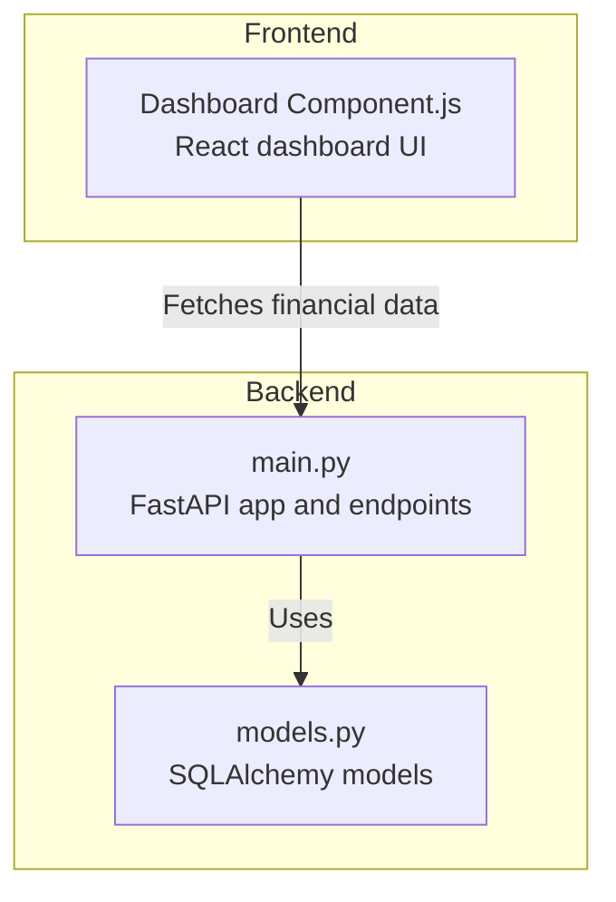
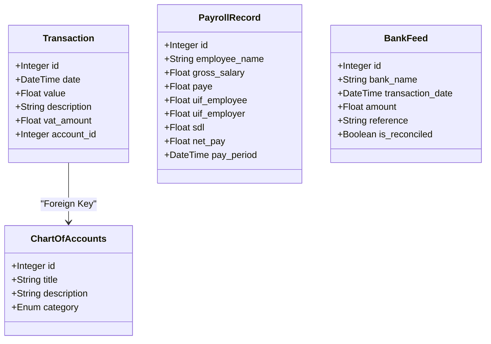
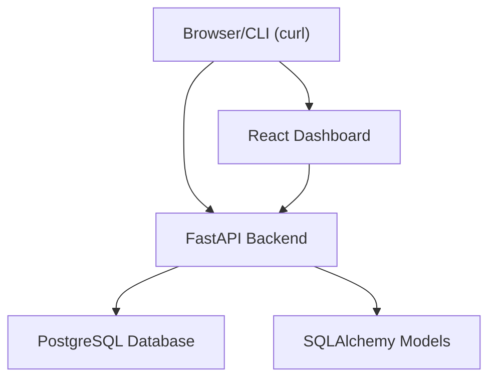
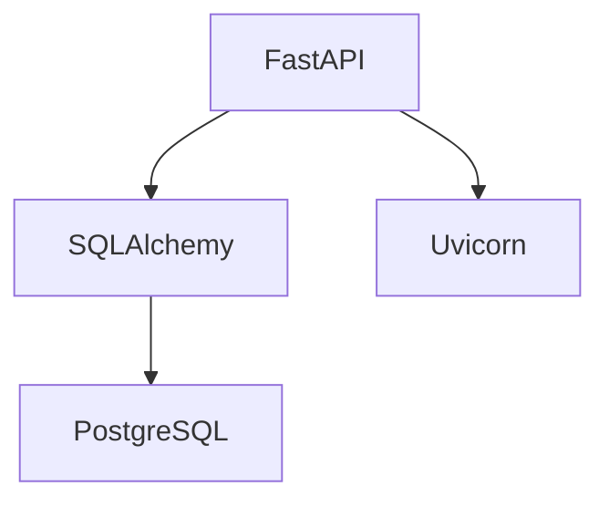

# Getting Started

<cite>
**Referenced Files in This Document**
- [main.py](file://sa-accounting-app/backend/main.py)
- [models.py](file://sa-accounting-app/backend/models.py)
- [Dashboard Component.js](file://sa-accounting-app/frontend/Dashboard%20Component.js)
</cite>

## Table of Contents
1. [Introduction](#introduction)
2. [Prerequisites](#prerequisites)
3. [Installation](#installation)
4. [Quick Start](#quick-start)
5. [Basic Usage Examples](#basic-usage-examples)
6. [Project Structure](#project-structure)
7. [Core Components](#core-components)
8. [Architecture Overview](#architecture-overview)
9. [Dependency Analysis](#dependency-analysis)
10. [Troubleshooting Guide](#troubleshooting-guide)
11. [Conclusion](#conclusion)

## Introduction
This guide helps you install, configure, and run the Accountflow application locally. It covers prerequisites, step-by-step installation, database setup, and practical usage examples for creating transactions and retrieving profit/loss reports. The application consists of a FastAPI backend and a minimal React frontend dashboard component.

## Prerequisites
Before installing Accountflow, ensure you have the following:
- Python 3.x: Required for the FastAPI backend.
- Node.js and npm: Required to run the React frontend locally.
- PostgreSQL: Required for the application database.
- pipenv or venv: Recommended to isolate Python dependencies.
- Git: Optional, for cloning the repository.

## Installation
Follow these steps to install and run Accountflow:

1. Clone the repository to your local machine.
2. Navigate to the backend directory:
   - Path: sa-accounting-app/backend
3. Create a Python virtual environment:
   - Example command: python -m venv venv
4. Activate the virtual environment:
   - On Windows: venv\Scripts\activate
   - On macOS/Linux: source venv/bin/activate
5. Install Python dependencies:
   - FastAPI and uvicorn for the backend server
   - SQLAlchemy for ORM and database connectivity
   - psycopg2-binary for PostgreSQL adapter
6. Install Node.js dependencies for the frontend:
   - From sa-accounting-app/frontend, run: npm install
7. Start the React frontend:
   - From sa-accounting-app/frontend, run: npm start

**Section sources**
- [main.py:1-17](file://sa-accounting-app/backend/main.py#L1-L17)
- [models.py:1-6](file://sa-accounting-app/backend/models.py#L1-L6)

## Quick Start
After completing installation, follow these steps to run the application:

1. Ensure PostgreSQL is installed and running locally.
2. Create the database and user as configured in the backend:
   - Database name: sa_accounting
   - Username: postgres
   - Password: postgres
   - Host: localhost
3. Initialize the database schema:
   - Use SQLAlchemy Base metadata to create tables defined in models.py
4. Start the FastAPI server:
   - From sa-accounting-app/backend, run: uvicorn main:app --reload
5. Open the React dashboard:
   - From sa-accounting-app/frontend, run: npm start
6. Verify the backend endpoints:
   - POST /transactions/ to record a transaction
   - GET /reports/pnl to retrieve profit/loss summary

**Section sources**
- [main.py:7-19](file://sa-accounting-app/backend/main.py#L7-L19)
- [models.py:15-30](file://sa-accounting-app/backend/models.py#L15-L30)

## Basic Usage Examples
The following examples demonstrate how to interact with the backend APIs using curl. Replace placeholders with your actual values.

- Create a transaction
  - Method: POST
  - Endpoint: http://localhost:8000/transactions/
  - Headers: Content-Type: application/json
  - Body: {"value": 1000.0, "desc": "Service Revenue"}
  - Expected response: {"message": "Transaction recorded", "vat": 150.0}

- Retrieve profit/loss report
  - Method: GET
  - Endpoint: http://localhost:8000/reports/pnl
  - Expected response: {"net_profit": <income_minus_expenses>}

Notes:
- The backend calculates a 15% VAT on transaction values.
- The profit/loss endpoint sums Income and Expense transactions and returns net profit.

**Section sources**
- [main.py:21-35](file://sa-accounting-app/backend/main.py#L21-L35)

## Project Structure
The repository is organized into backend and frontend directories. The backend contains the FastAPI application and SQLAlchemy models. The frontend includes a React dashboard component.

**Diagram sources**
- [main.py:19-35](file://sa-accounting-app/backend/main.py#L19-L35)
- [models.py:15-30](file://sa-accounting-app/backend/models.py#L15-L30)
- [Dashboard Component.js:1-26](file://sa-accounting-app/frontend/Dashboard%20Component.js#L1-L26)

**Section sources**
- [main.py:19-35](file://sa-accounting-app/backend/main.py#L19-L35)
- [models.py:15-30](file://sa-accounting-app/backend/models.py#L15-L30)
- [Dashboard Component.js:1-26](file://sa-accounting-app/frontend/Dashboard%20Component.js#L1-L26)

## Core Components
This section describes the key components of the application and their roles.

- FastAPI Application
  - Initializes the API server and registers routes for transactions and profit/loss reporting.
  - Provides dependency injection for database sessions.

- Database Models
  - Define tables for chart of accounts, transactions, payroll records, and bank feeds.
  - Include enums for account categories and foreign key relationships.

- Frontend Dashboard
  - A React component that displays financial summaries such as Accounts Receivable and Accounts Payable.

**Diagram sources**
- [models.py:15-50](file://sa-accounting-app/backend/models.py#L15-L50)

**Section sources**
- [main.py:19-35](file://sa-accounting-app/backend/main.py#L19-L35)
- [models.py:15-50](file://sa-accounting-app/backend/models.py#L15-L50)
- [Dashboard Component.js:1-26](file://sa-accounting-app/frontend/Dashboard%20Component.js#L1-L26)

## Architecture Overview
The application follows a simple layered architecture:
- Backend: FastAPI handles HTTP requests, interacts with SQLAlchemy models, and connects to PostgreSQL.
- Frontend: React renders financial summaries and can integrate with backend endpoints.

**Diagram sources**
- [main.py:7-19](file://sa-accounting-app/backend/main.py#L7-L19)
- [models.py:15-30](file://sa-accounting-app/backend/models.py#L15-L30)
- [Dashboard Component.js:1-26](file://sa-accounting-app/frontend/Dashboard%20Component.js#L1-L26)

## Dependency Analysis
Key runtime dependencies used by the backend:
- FastAPI: Web framework for building APIs.
- SQLAlchemy: ORM toolkit and SQL expression language.
- psycopg2-binary: PostgreSQL adapter for Python.
- uvicorn: ASGI server to run the FastAPI application.

**Diagram sources**
- [main.py:1-5](file://sa-accounting-app/backend/main.py#L1-L5)

**Section sources**
- [main.py:1-5](file://sa-accounting-app/backend/main.py#L1-L5)

## Troubleshooting Guide
Common setup issues and resolutions:

- Database connection fails
  - Verify PostgreSQL is running locally.
  - Confirm credentials match the configured URL: postgres:postgres@localhost/sa_accounting.
  - Ensure the database exists and the user has privileges.

- Dependency conflicts during installation
  - Use a virtual environment to avoid system-wide conflicts.
  - Reinstall packages after activating the virtual environment.

- Port already in use
  - Change the port when starting uvicorn if 8000 is occupied.
  - Ensure no other service is using the same port.

- Frontend not starting
  - Install Node.js dependencies in the frontend directory.
  - Run the React app from the frontend directory.

**Section sources**
- [main.py:7-19](file://sa-accounting-app/backend/main.py#L7-L19)

## Conclusion
You now have the foundational steps to install, configure, and run Accountflow locally. Use the provided endpoints to create transactions and retrieve profit/loss summaries. Expand the frontend by integrating the dashboard component with backend data and extend the backend by adding more endpoints and models as needed.