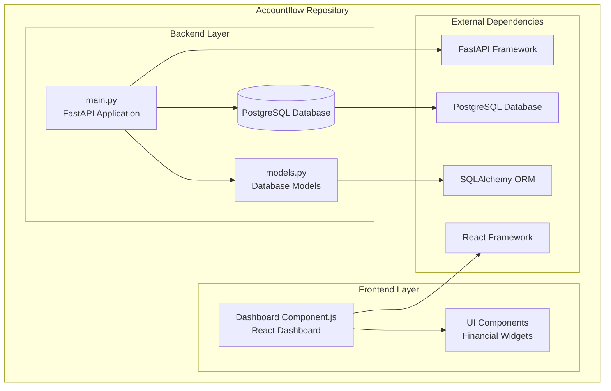
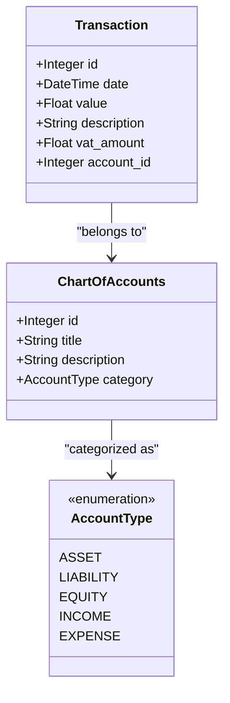
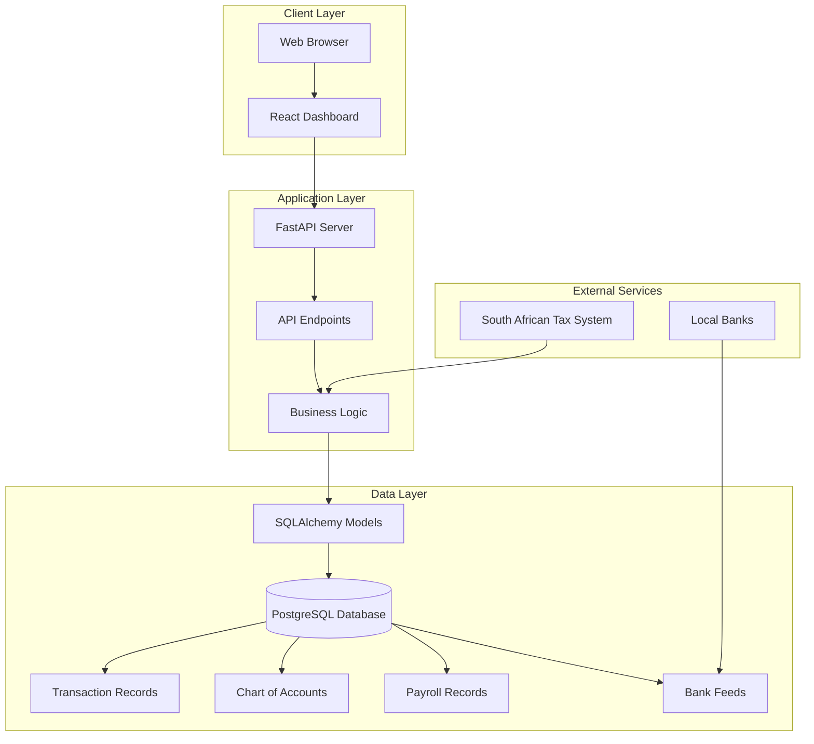
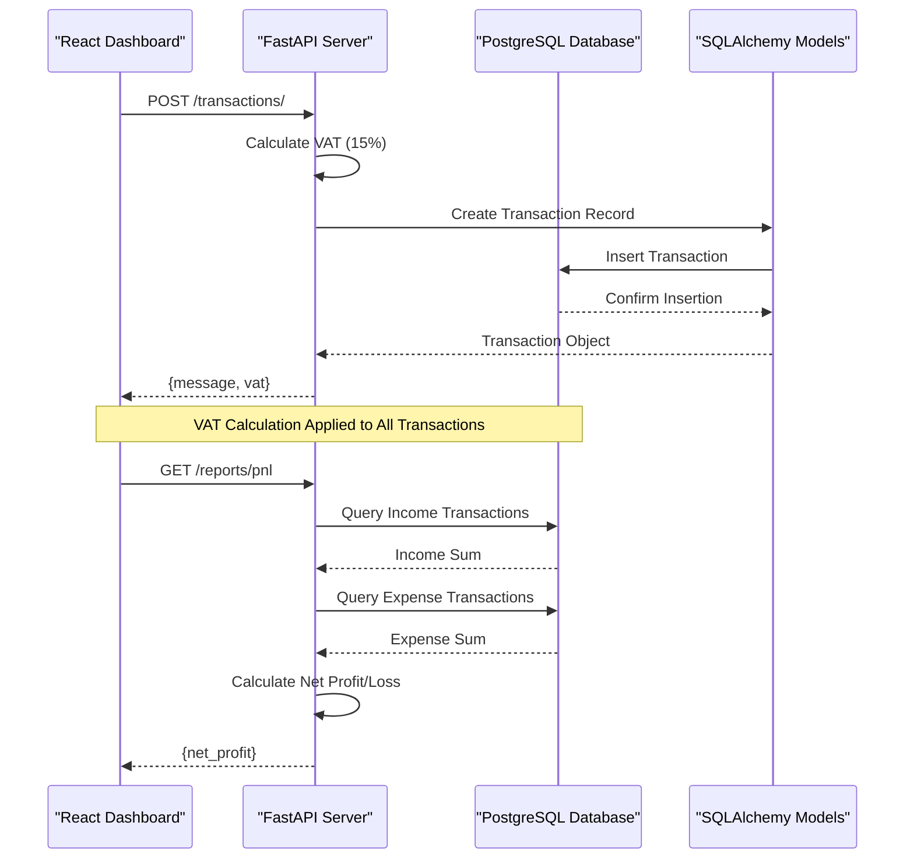
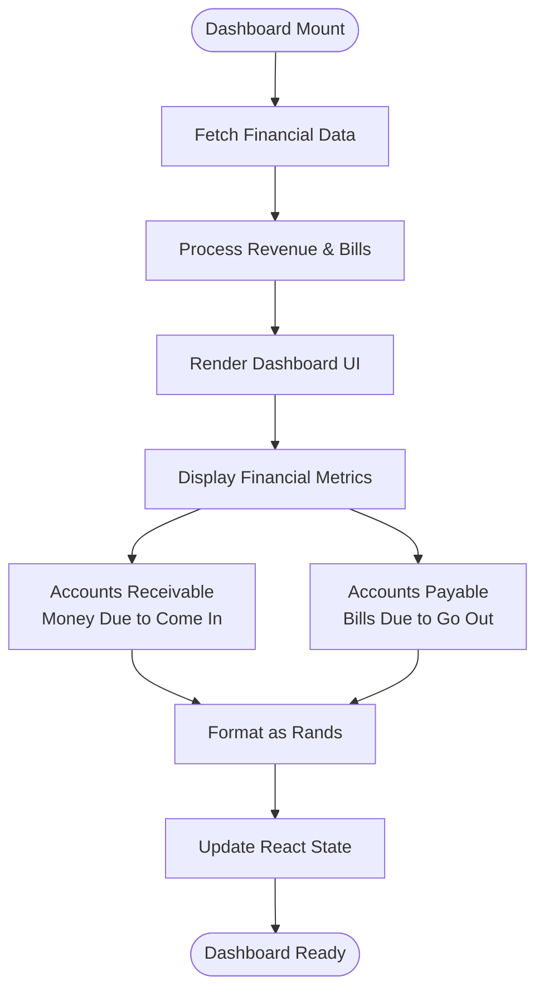
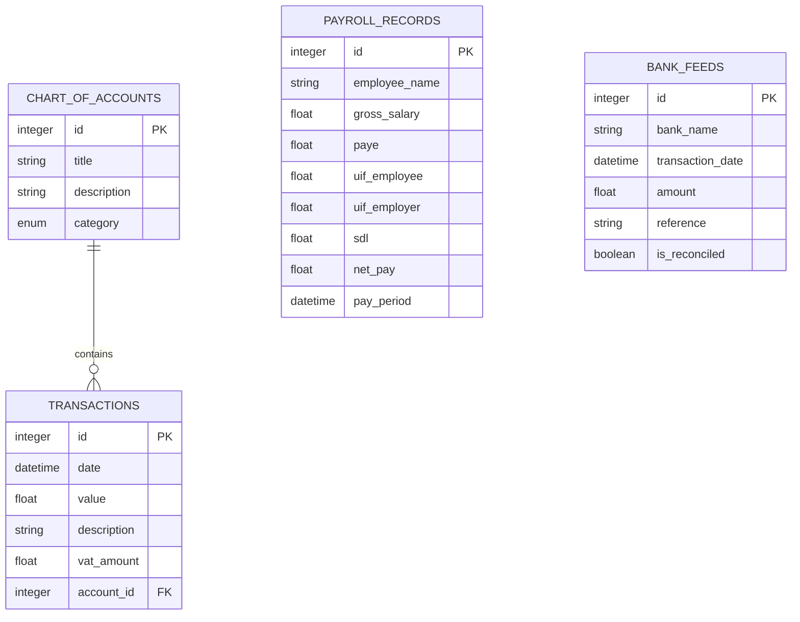
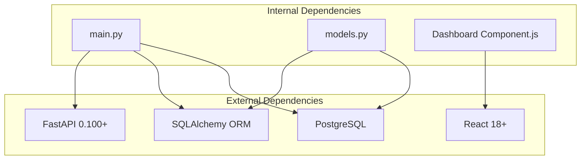

# Project Overview

<cite>
**Referenced Files in This Document**
- [backend/main.py](file://sa-accounting-app/backend/main.py)
- [backend/models.py](file://sa-accounting-app/backend/models.py)
- [frontend/Dashboard Component.js](file://sa-accounting-app/frontend/Dashboard Component.js)
</cite>

## Table of Contents
1. [Introduction](#introduction)
2. [Project Structure](#project-structure)
3. [Core Components](#core-components)
4. [Architecture Overview](#architecture-overview)
5. [Detailed Component Analysis](#detailed-component-analysis)
6. [Dependency Analysis](#dependency-analysis)
7. [Performance Considerations](#performance-considerations)
8. [Troubleshooting Guide](#troubleshooting-guide)
9. [Conclusion](#conclusion)

## Introduction
Accountflow is a simplified financial transaction recording system tailored for South African businesses. It provides a streamlined approach to managing day-to-day accounting tasks while maintaining compliance with local tax regulations. The application focuses on essential accounting workflows including transaction recording, profit and loss reporting, and payroll processing, with built-in support for South African Value Added Tax (VAT) calculations at 15%.

The system follows a monolithic architecture pattern, integrating both the backend API server and frontend dashboard within a single repository structure. This approach enables rapid development and deployment while keeping the codebase manageable for small to medium-sized businesses operating in South Africa.

## Project Structure
The project adopts a clear separation of concerns through distinct backend and frontend directories, each containing specialized components for their respective domains.

**Diagram sources**
- [backend/main.py:1-35](file://sa-accounting-app/backend/main.py#L1-L35)
- [backend/models.py:1-50](file://sa-accounting-app/backend/models.py#L1-L50)
- [frontend/Dashboard Component.js:1-26](file://sa-accounting-app/frontend/Dashboard Component.js#L1-L26)

The backend layer consists of two primary files:
- **main.py**: Houses the FastAPI application definition, database connection setup, and core API endpoints
- **models.py**: Defines the complete database schema using SQLAlchemy ORM with comprehensive accounting models

The frontend layer provides a React-based dashboard component that displays financial summaries and key metrics for business monitoring.

**Section sources**
- [backend/main.py:1-35](file://sa-accounting-app/backend/main.py#L1-L35)
- [backend/models.py:1-50](file://sa-accounting-app/backend/models.py#L1-L50)
- [frontend/Dashboard Component.js:1-26](file://sa-accounting-app/frontend/Dashboard Component.js#L1-L26)

## Core Components
The system's core functionality revolves around four fundamental accounting models that form the backbone of the financial management system.

### Transaction Model
The Transaction model serves as the central record for all financial activities, capturing essential details required for South African accounting compliance.

**Diagram sources**
- [backend/models.py:22-30](file://sa-accounting-app/backend/models.py#L22-L30)
- [backend/models.py:15-21](file://sa-accounting-app/backend/models.py#L15-L21)
- [backend/models.py:8-14](file://sa-accounting-app/backend/models.py#L8-L14)

### ChartOfAccounts Model
The ChartOfAccounts model establishes the foundation for organizing financial transactions within the traditional accounting equation framework, categorizing accounts into five primary types: Assets, Liabilities, Equity, Income, and Expenses.

### PayrollRecord Model
The PayrollRecord model handles South African payroll processing requirements, including mandatory deductions such as PAYE (Pay As You Earn), UIF contributions, and SDL (Skills Development Levy) where applicable.

### BankFeed Model
The BankFeed model captures external bank transaction data for reconciliation purposes, enabling automated matching between bank statements and recorded transactions.

**Section sources**
- [backend/models.py:22-30](file://sa-accounting-app/backend/models.py#L22-L30)
- [backend/models.py:15-21](file://sa-accounting-app/backend/models.py#L15-L21)
- [backend/models.py:31-42](file://sa-accounting-app/backend/models.py#L31-L42)
- [backend/models.py:43-50](file://sa-accounting-app/backend/models.py#L43-L50)

## Architecture Overview
Accountflow implements a monolithic architecture pattern that combines the FastAPI backend server with a React frontend dashboard in a single codebase. This design choice prioritizes simplicity and ease of deployment for small to medium-sized South African businesses.

**Diagram sources**
- [backend/main.py:19-35](file://sa-accounting-app/backend/main.py#L19-L35)
- [backend/models.py:1-50](file://sa-accounting-app/backend/models.py#L1-L50)

The architecture follows a clear request-response pattern where the React dashboard communicates with the FastAPI server through RESTful endpoints. The backend handles all business logic, data validation, and tax calculations, while the frontend focuses solely on user interface presentation and data visualization.

Key architectural characteristics include:
- **Single Database Connection**: PostgreSQL serves as the central data store for all accounting records
- **Centralized Business Logic**: All tax calculations and financial validations occur within the backend service
- **Separation of Concerns**: Clear distinction between presentation layer (React) and business logic layer (FastAPI)
- **Monolithic Deployment**: Both frontend and backend components deployed together for simplified management

## Detailed Component Analysis

### Backend FastAPI Server
The backend FastAPI server provides two primary endpoints for transaction recording and financial reporting, with integrated South African VAT calculations.

**Diagram sources**
- [backend/main.py:21-35](file://sa-accounting-app/backend/main.py#L21-L35)
- [backend/models.py:22-30](file://sa-accounting-app/backend/models.py#L22-L30)

The transaction recording endpoint demonstrates the system's commitment to South African accounting standards by automatically calculating VAT at the statutory rate of 15% for all incoming transactions. The profit and loss reporting endpoint provides immediate visibility into the business's financial performance by aggregating income and expense transactions.

### Frontend React Dashboard
The React dashboard component presents financial summaries in an intuitive interface, focusing on key business metrics that drive decision-making.

**Diagram sources**
- [frontend/Dashboard Component.js:3-23](file://sa-accounting-app/frontend/Dashboard Component.js#L3-L23)

The dashboard currently displays two primary financial metrics: Accounts Receivable (money due to come in) and Accounts Payable (bills due to go out), both presented in South African Rand currency format. This visualization helps business owners quickly assess their cash flow position and liquidity management.

### Database Schema and Relationships
The database schema establishes a comprehensive foundation for South African accounting practices, with clear relationships between core models.

**Diagram sources**
- [backend/models.py:15-30](file://sa-accounting-app/backend/models.py#L15-L30)
- [backend/models.py:22-50](file://sa-accounting-app/backend/models.py#L22-L50)

The schema design incorporates South African accounting standards through:
- **Chart of Accounts Classification**: Proper categorization of assets, liabilities, equity, income, and expenses
- **Transaction Tracking**: Comprehensive recording of all financial activities with VAT calculations
- **Payroll Compliance**: Built-in support for mandatory South African payroll deductions
- **Bank Reconciliation**: Dedicated model for tracking and reconciling bank transactions

**Section sources**
- [backend/main.py:21-35](file://sa-accounting-app/backend/main.py#L21-L35)
- [frontend/Dashboard Component.js:3-23](file://sa-accounting-app/frontend/Dashboard Component.js#L3-L23)
- [backend/models.py:15-50](file://sa-accounting-app/backend/models.py#L15-L50)

## Dependency Analysis
The system maintains minimal external dependencies while leveraging mature frameworks for reliable operation.

**Diagram sources**
- [backend/main.py:1-5](file://sa-accounting-app/backend/main.py#L1-L5)
- [backend/models.py:1](file://sa-accounting-app/backend/models.py#L1)
- [frontend/Dashboard Component.js:1](file://sa-accounting-app/frontend/Dashboard Component.js#L1)

The dependency structure reflects the monolithic approach with clear separation between internal components and external frameworks. The backend depends on FastAPI for web service capabilities and SQLAlchemy for database operations, while the frontend relies on React for user interface development.

**Section sources**
- [backend/main.py:1-5](file://sa-accounting-app/backend/main.py#L1-L5)
- [backend/models.py:1](file://sa-accounting-app/backend/models.py#L1)
- [frontend/Dashboard Component.js:1](file://sa-accounting-app/frontend/Dashboard Component.js#L1)

## Performance Considerations
The current implementation prioritizes simplicity and correctness over advanced performance optimizations. Several considerations apply to the monolithic architecture:

- **Database Connection Management**: The application uses a single database connection pool suitable for small-scale deployments
- **API Response Times**: Simple queries for transaction recording and profit/loss reporting should provide adequate response times
- **Frontend Rendering**: React components render efficiently for dashboard visualization with minimal data processing
- **Scalability Limitations**: The monolithic design may require architectural changes for high-traffic scenarios

## Troubleshooting Guide
Common issues and their resolution strategies for the Accountflow system:

### Database Connection Issues
- **Problem**: Unable to connect to PostgreSQL database
- **Solution**: Verify database credentials and connection string in the main.py file
- **Prevention**: Ensure PostgreSQL service is running and accepts connections

### VAT Calculation Errors
- **Problem**: Incorrect VAT amounts in transaction records
- **Solution**: Verify the 15% VAT calculation logic in the transaction creation endpoint
- **Prevention**: Test with various transaction values to confirm accuracy

### Frontend Dashboard Display Issues
- **Problem**: Financial metrics not displaying correctly
- **Solution**: Check React state management and currency formatting in the dashboard component
- **Prevention**: Validate data fetching and state updates in the component lifecycle

**Section sources**
- [backend/main.py:8-17](file://sa-accounting-app/backend/main.py#L8-L17)
- [backend/main.py:21-28](file://sa-accounting-app/backend/main.py#L21-L28)
- [frontend/Dashboard Component.js:3-23](file://sa-accounting-app/frontend/Dashboard Component.js#L3-L23)

## Conclusion
Accountflow represents a pragmatic solution for South African businesses seeking a simplified yet comprehensive accounting system. The monolithic architecture provides an excellent foundation for small to medium-sized enterprises, combining essential accounting functionality with local regulatory compliance.

The system's strength lies in its focus on core accounting workflows: transaction recording with automatic VAT calculations, profit and loss reporting, and payroll processing. The clear separation between backend and frontend components ensures maintainability while the monolithic approach simplifies deployment and reduces operational complexity.

Future enhancements could include expanded reporting capabilities, advanced reconciliation features, and integration with South African tax filing systems. However, the current implementation provides a solid foundation for businesses requiring reliable financial transaction management with built-in compliance for South African accounting standards.